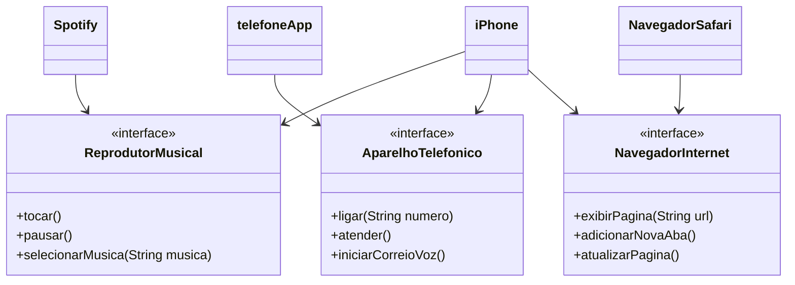

# [DIO](www.dio.me) - Trilha Java Básico

## Autores
- [Gleyson Sampaio](https://github.com/glysns)

## POO - Desafio

### Modelagem e Diagramação de um Componente iPhone

Neste desafio, você será responsável por modelar e diagramar a representação UML do componente iPhone, abrangendo suas funcionalidades como Reprodutor Musical, Aparelho Telefônico e Navegador na Internet.

#### Contexto
Com base no vídeo de lançamento do iPhone de 2007 (link abaixo), você deve elaborar a diagramação das classes e interfaces utilizando uma ferramenta UML de sua preferência. Em seguida, implemente as classes e interfaces no formato de arquivos `.java`.

[Lançamento iPhone 2007](https://www.youtube.com/watch?v=9ou608QQRq8)
- Minutos relevantes: 00:15 até 00:55

#### Funcionalidades a Modelar
1. **Reprodutor Musical**
   - Métodos: `tocar()`, `pausar()`, `selecionarMusica(String musica)`
2. **Aparelho Telefônico**
   - Métodos: `ligar(String numero)`, `atender()`, `iniciarCorreioVoz()`
3. **Navegador na Internet**
   - Métodos: `exibirPagina(String url)`, `adicionarNovaAba()`, `atualizarPagina()`

### Objetivo
1. Criar um diagrama UML que represente as funcionalidades descritas acima.
2. Implementar as classes e interfaces correspondentes em Java (Opcional).

##Minha Resolução
- Para minha resolução optei por criar interfaces e classes de aplicativos que fariam uso dessa interfacem, tentando demonstrar e implementar uma solução o mais próxima possível da experiência real, respeitando as normas e requisitos do desafio.
- Os aplicativos exemplo escolhidos para o uso da interface são o Telefone (Aplicativo padrão), Spotify para o reprodutor de músicas e o navegador Safari.
-  A representação dos aplicativos é meramente ilustrativa assim como descrito no desafio, não se trata da implementação dos aplicativos propriamente ditos dentro do código.

### Modelagem Iphone

